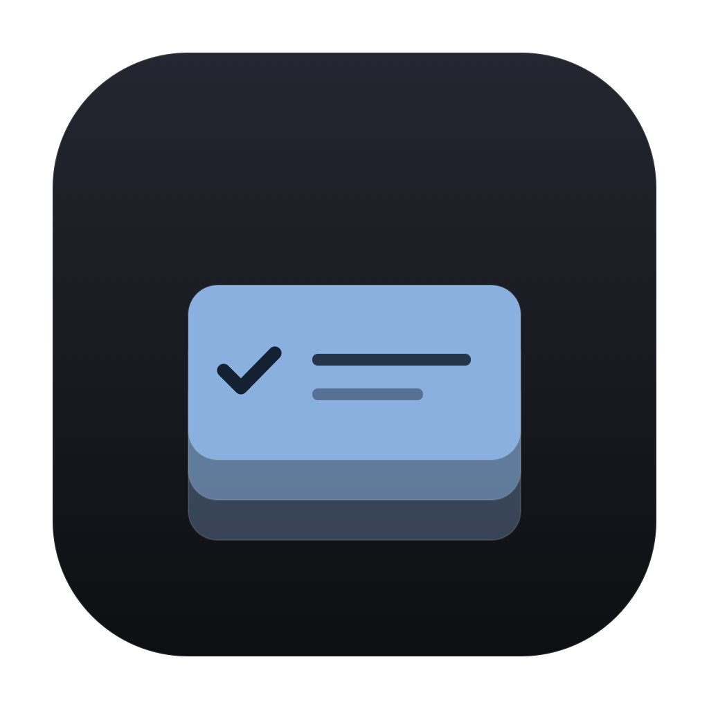
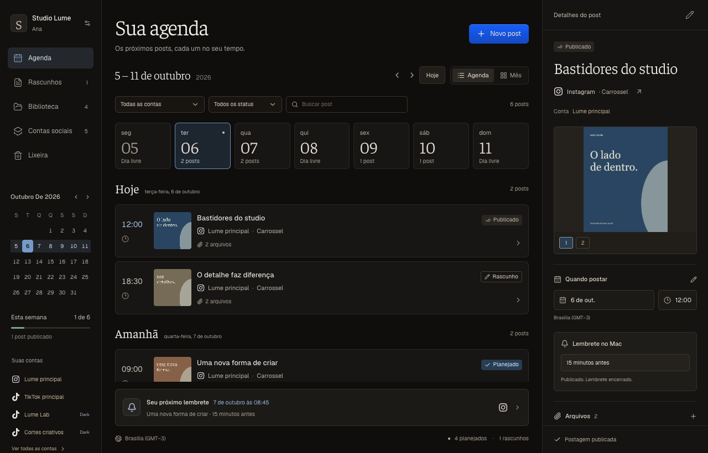
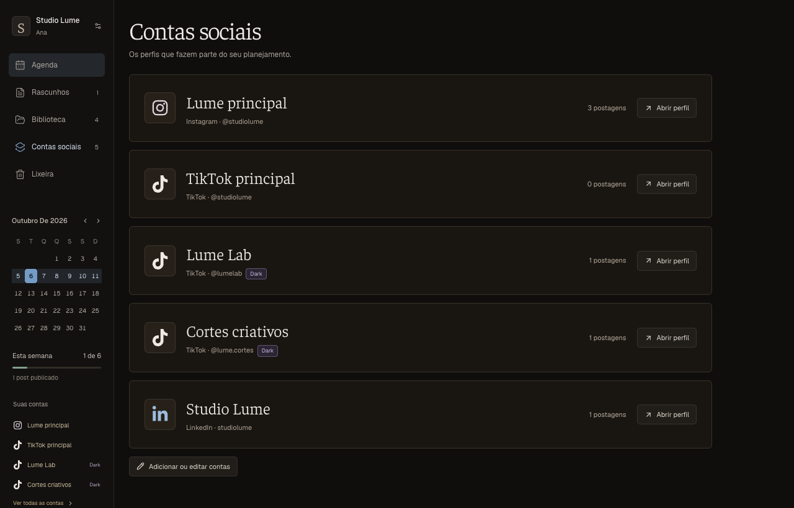
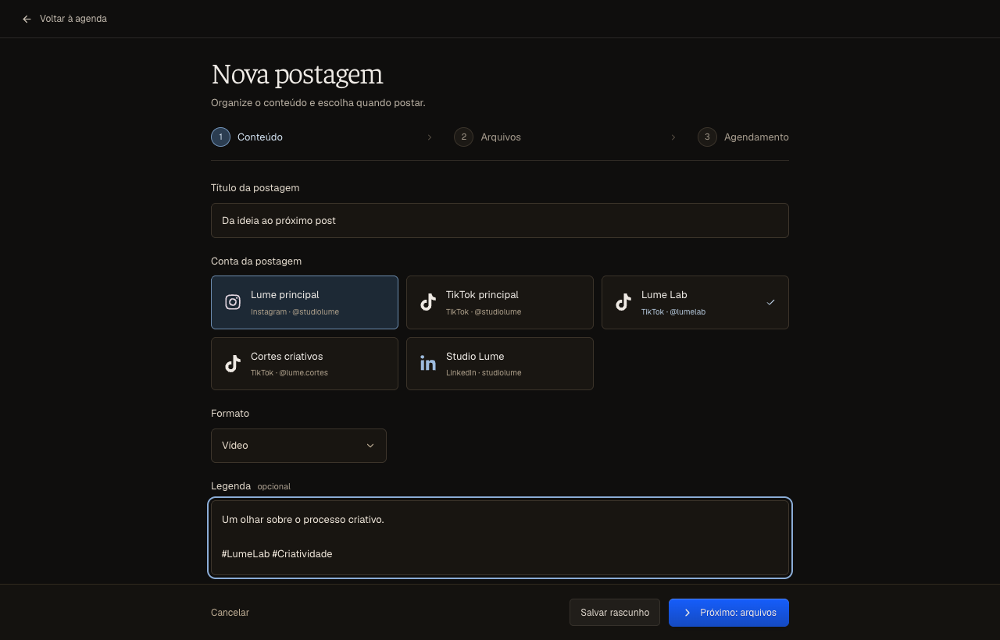
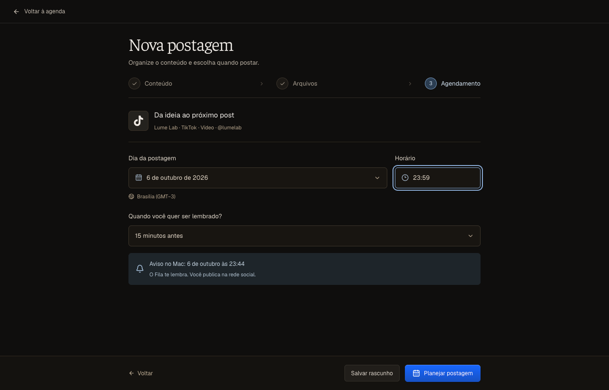
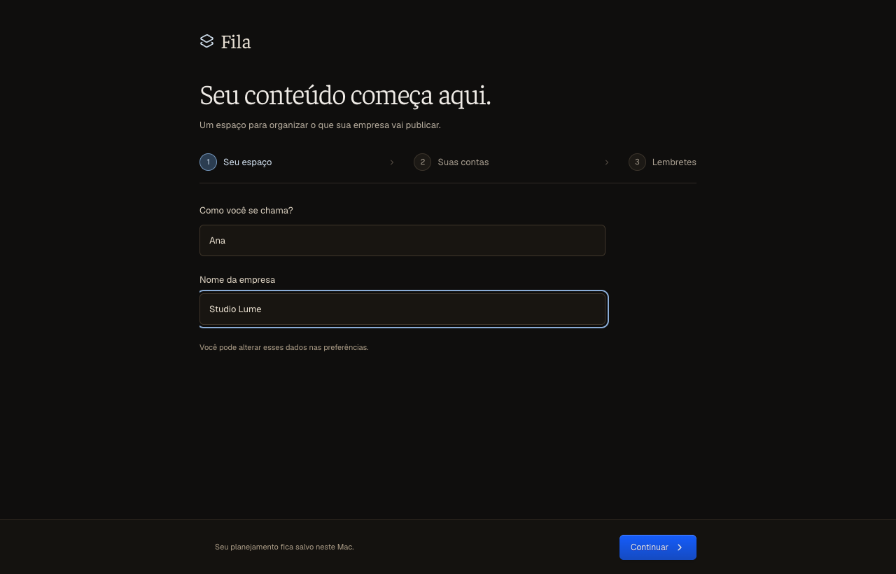
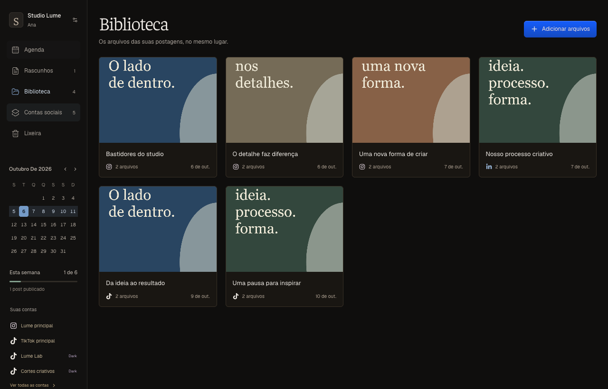

<div align="center">
  
  <h1>Fila</h1>
  <p>Seu conteúdo, seus arquivos e o próximo horário de postar.</p>
  <p>
    <a href="https://github.com/kaikynetto/Fila/releases/latest"><strong>Baixar para macOS</strong></a> ·
    <a href="#desenvolvimento">Compilar o projeto</a> ·
    <a href="https://github.com/kaikynetto/Fila/issues">Reportar um problema</a>
  </p>
  
  
  
</div>

<br />



Um app de Mac para cuidar do planejamento de conteúdo da sua empresa. Escolha a conta, separe a mídia e marque o dia e o horário. O Fila guarda tudo junto e pede ao macOS para te lembrar quando chegar a hora.

A publicação é feita por você na rede social. Os perfis cadastrados servem para organizar as postagens; o app não pede senhas nem conecta às APIs das redes.

### Cada conta tem o seu lugar

Uma empresa pode ter três TikToks, um Instagram e vários projetos dark. Cada perfil tem nome interno, rede e identificação própria. A postagem fica ligada à conta escolhida, e a agenda pode ser filtrada por conta.



### Da ideia ao horário, em três etapas

**Conteúdo → Arquivos → Agendamento.** Uma tela dedicada, controles próprios e espaço para revisar cada parte.

| Conteúdo | Agendamento |
| :---: | :---: |
|  |  |

- Onboarding com seu nome, empresa, contas sociais e fuso horário.
- Instagram, TikTok, LinkedIn, Facebook, YouTube e X, com os logos das redes.
- Agenda semanal, calendário mensal, busca e filtros por conta e status.
- Rascunhos, postagens planejadas e marcação manual de publicação.
- Importação e arraste de imagens, vídeos e PDFs. O app guarda cópias dos arquivos e permite ordenar os anexos.
- Biblioteca, prévias de mídia, cópia da legenda e exportação dos arquivos.
- Lembretes locais no horário escolhido ou alguns minutos antes. Publicar, mudar para rascunho ou mover para a lixeira cancela o aviso correspondente.
- Lixeira com restauração como rascunho e exportação do planejamento em JSON.

| Primeiro acesso | Biblioteca |
| :---: | :---: |
|  |  |

As imagens usam dados fictícios do Studio Lume. São geradas a partir da interface do projeto; o roteiro de captura usa uma ponte de dados simulada em navegador headless.

### Instalar

Baixe `Fila-macOS.zip` na [última versão](https://github.com/kaikynetto/Fila/releases/latest), extraia e mova `Fila.app` para Aplicativos. Requer macOS 13 ou posterior. O pacote é universal, para Apple Silicon e Intel.

Esta primeira versão possui assinatura local ad-hoc e ainda não é notarizada pela Apple. O macOS pode solicitar aprovação manual para abrir o download.

No primeiro acesso, configure sua empresa e seus perfis. Permita as notificações para receber os lembretes. Você pode continuar sem essa permissão e ativá-la depois nas preferências. A apresentação dos avisos também depende dos ajustes de Notificações e Foco do macOS.

### Dados no seu Mac

O planejamento é salvo em JSON na pasta Application Support do app, dentro do contêiner do sandbox. As mídias importadas ficam em uma pasta `Media`. O arquivo anterior do planejamento é mantido como `workspace.previous.json` quando você salva mudanças.

Use **Preferências → Abrir pasta de dados** para localizar os arquivos. **Exportar planejamento** salva os metadados em JSON; copie também a pasta de mídias para guardar um backup completo. Não há sincronização em nuvem nem telemetria. A interface, as fontes e os ícones vêm incorporados ao app.

### Desenvolvimento

Requisitos: macOS, Xcode com suporte a Swift 5, Node.js 22.18 ou posterior e npm. Os testes TypeScript usam o suporte nativo do Node a remoção de tipos.

```sh
git clone https://github.com/kaikynetto/Fila.git
cd Fila
npm --prefix Web ci
zsh scripts/build-app.sh
```

O app compilado fica em `build/Fila.app`. O script monta a interface offline, compila para as duas arquiteturas e aplica a assinatura local com as permissões do sandbox. Para compilar em Debug: `FILA_CONFIGURATION=Debug zsh scripts/build-app.sh`.

Para editar a interface no navegador:

```sh
npm --prefix Web run dev
```

O modo web de desenvolvimento salva em `localStorage`. Importação de arquivos e notificações precisam do app nativo.

```text
Fila/        SwiftUI, WebKit, persistência, importação e notificações
Web/src/     Interface React, fluxo de criação e regras de agendamento
scripts/     Build, empacotamento, ícone e capturas de documentação
tests/       Testes do armazenamento nativo
Design/      Cores, tipografia e decisões de interface
```

### Verificação

```sh
npm --prefix Web test
npm --prefix Web run build
xcrun swiftc Fila/AppStore.swift tests/NativeStoreTests.swift -o /tmp/fila-native-tests
/tmp/fila-native-tests
```

Os testes cobrem datas, fusos, passagem de dia, horários inválidos, validação de planejamento, persistência, backup, importação e vínculo entre postagens e múltiplas contas da mesma rede.

Para regenerar as imagens e verificar onboarding, criação e recarga com dados fictícios:

```sh
npm --prefix Web run build
node scripts/capture-screenshots.mjs
```

Esse comando inicia um navegador headless separado. Por padrão usa o executável do Google Chrome instalado no Mac; `FILA_CHROME` permite indicar outro Chromium. Nenhum perfil pessoal é utilizado.

O ícone também é reproduzível pelo código:

```sh
xcrun swift scripts/make-icon.swift "$PWD"
iconutil -c icns .build/Fila.iconset -o Fila/FilaIcon.icns
```

### Interface e créditos

Tema escuro com Geist nos controles e Faustina nos títulos, inspirado na direção tipográfica de [Eleição Bolha Dev](https://eleicaobolhadev.com/). Componentes Badge, RichButton e LabelInput do [Spell UI](https://spell.sh/), instalados pelo registry oficial configurado em `Web/components.json`. Logos das redes pelo Font Awesome Brands.

Criado por [Kaiky](https://github.com/kaikynetto). Código sob [licença MIT](LICENSE). Consulte [os créditos e licenças de terceiros](THIRD_PARTY_NOTICES.md).
